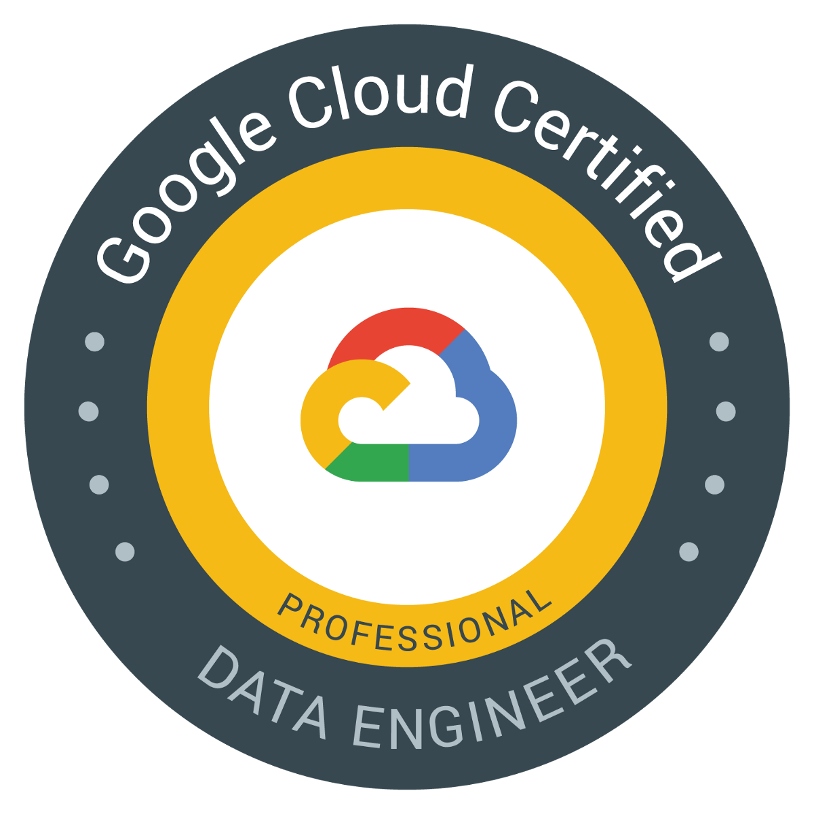

# GCP-Data-Engineering
Notes taken and exercises done on the Data Engineering on Google Cloud Platform Specialization

## Data Engineering on Google Cloud Platform Specialization by Cloudera

- Duration: five-weeks
- Content: 5 course of 1 week each

### 1. Google Cloud Platform Big Data and Machine Learning Fundamentals
Introduction to the Big Data and Machine Learning capabilities of Google Cloud Platform (GCP)

### 2. Leveraging Unstructured Data with Cloud Dataproc on Google Cloud Platform
Create and manage computing clusters to run Hadoop, Spark, Pig and/or Hive jobs on Google Cloud Platform. Access various cloud storage options from their compute clusters and integrate Google’s machine learning capabilities into their analytics programs

### 3. Serverless Data Analysis with Google BigQuery and Cloud Dataflow
Carry out no-ops data warehousing, analysis and pipeline processing

### 4. Serverless Machine Learning with Tensorflow on Google Cloud Platform
Machine learning (ML) and TensorFlow concepts

### 5. Building Resilient Streaming Systems on Google Cloud Platform
Streaming data pipelines using Google Cloud Pub/Sub and Dataflow to enable real-time decision making
